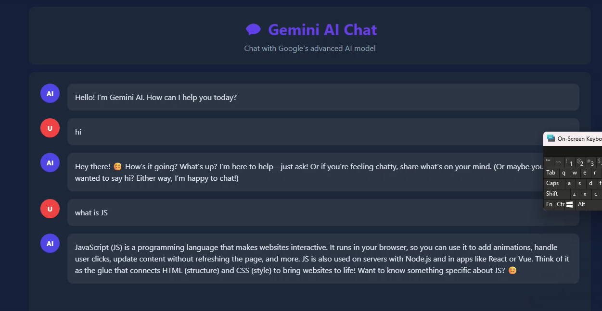
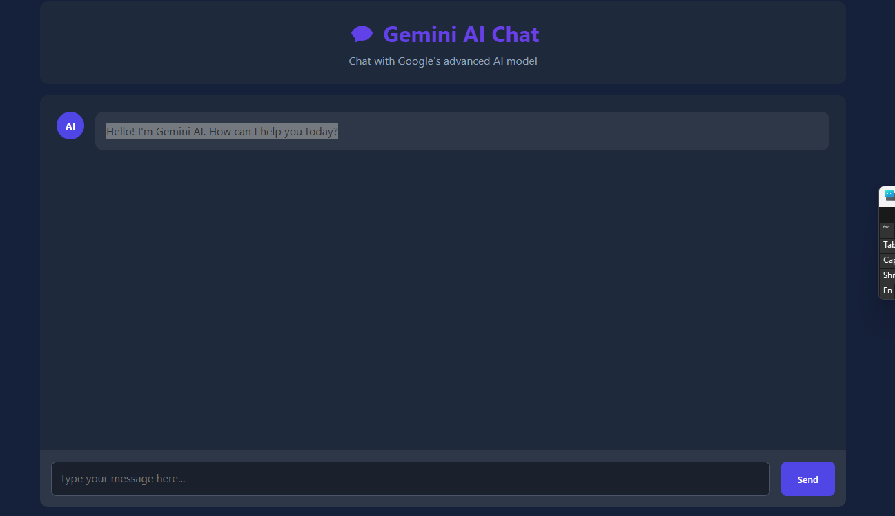

# AI Chat Assistant - Gemini API

# Description:
 A simple web-based AI Chat Assistant built with
 HTML, CSS, and Vanilla JavaScript.
 It connects to Google Gemini API to generate responses.


# Features

 - Clean chat UI
 - Auto-resizing textarea
 - Typing indicator animation
 - Error handling
 - Simple conversational replies
 - Uses Gemini 1.5 Flash model


# Technologies Used

 - HTML
 - CSS
 - JavaScript (Vanilla JS)
 - Google Gemini API


# Project Structure

```
project-folder/
│
├── index.html
├── style.css
├── script.js
└── README.md
```

# Setup Instructions

1. Clone the repository
```bash
git clone https://github.com/your-username/your-repo-name.git
```
```bash
cd your-repo-name
```

2. Add your API key
 Open script.js
 Replace:
 key=YourAPIKEY
 With:
 key=YOUR_REAL_API_KEY

# IMPORTANT:
 Do NOT expose your API key in public repositories.
 For production, use a backend server.

 3. Run the project
 Option 1:
Open index.html in your browser

 Option 2 (Recommended):
 Use Live Server in VS Code


## Screenshot



# API Endpoint Used


POST https://generativelanguage.googleapis.com/v1beta/models/gemini-1.5-flash:generateContent


# Future Improvements

 - Move API call to backend (Node.js)
 - Add message history
 - Add dark/light mode
 - Improve UI
 - Add timestamps

# License

This project is for learning purposes.
